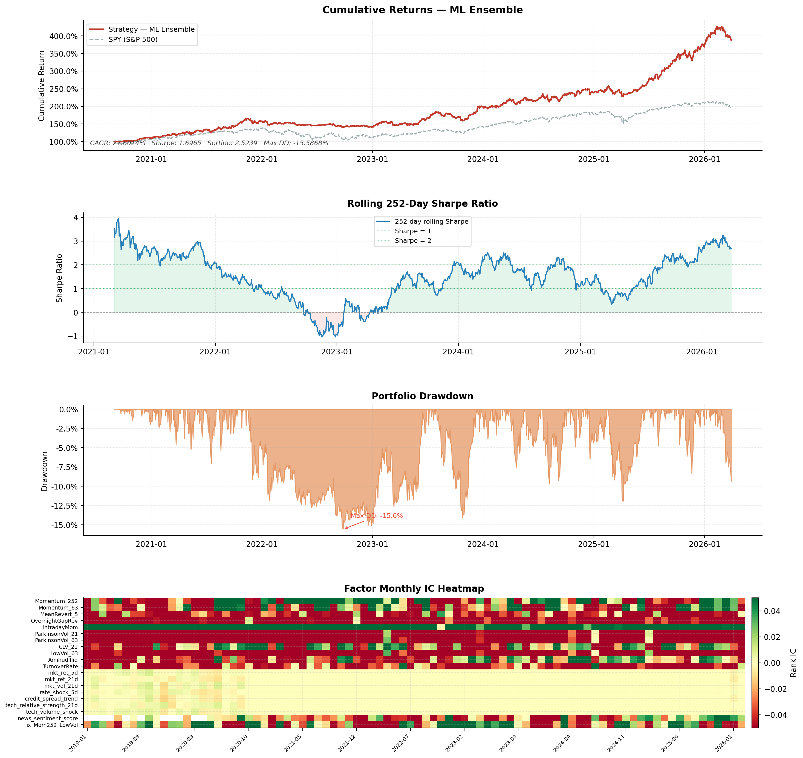
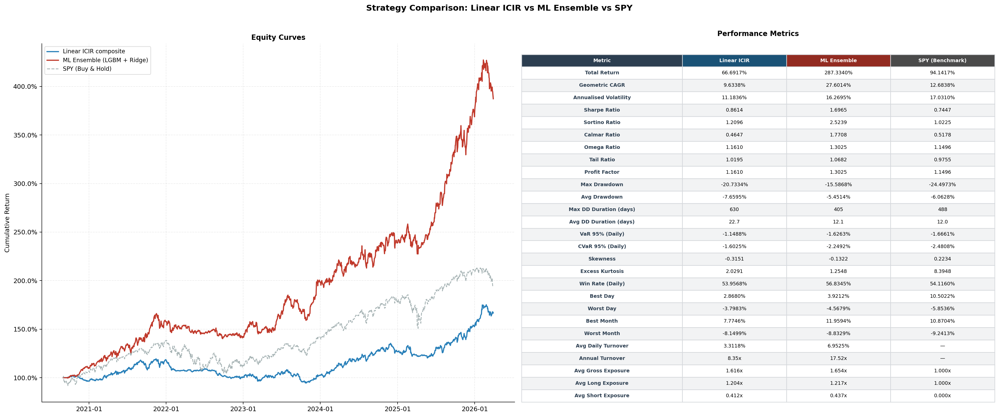
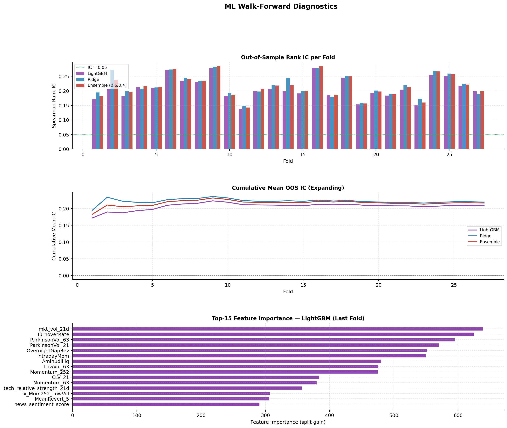
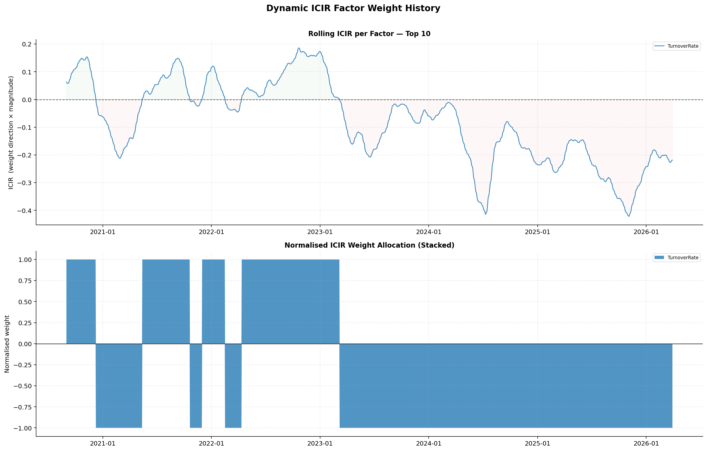
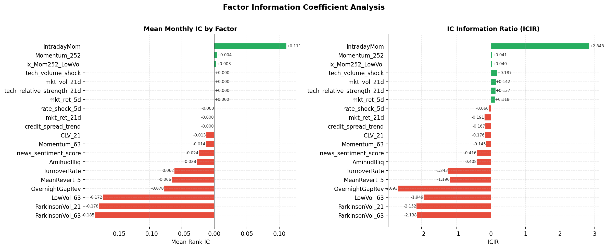
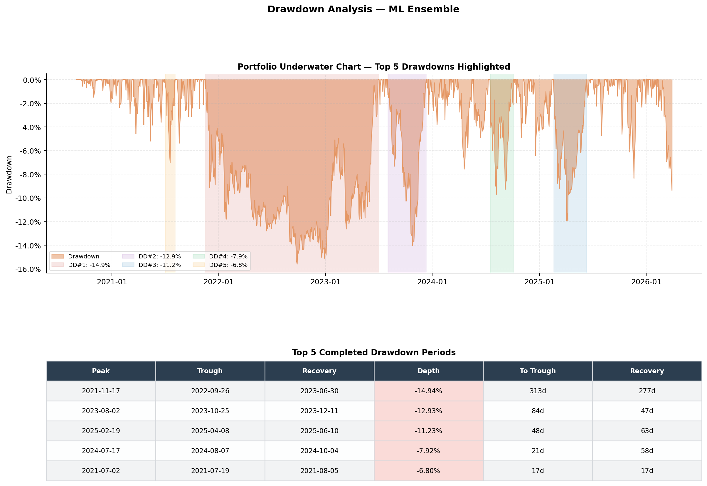
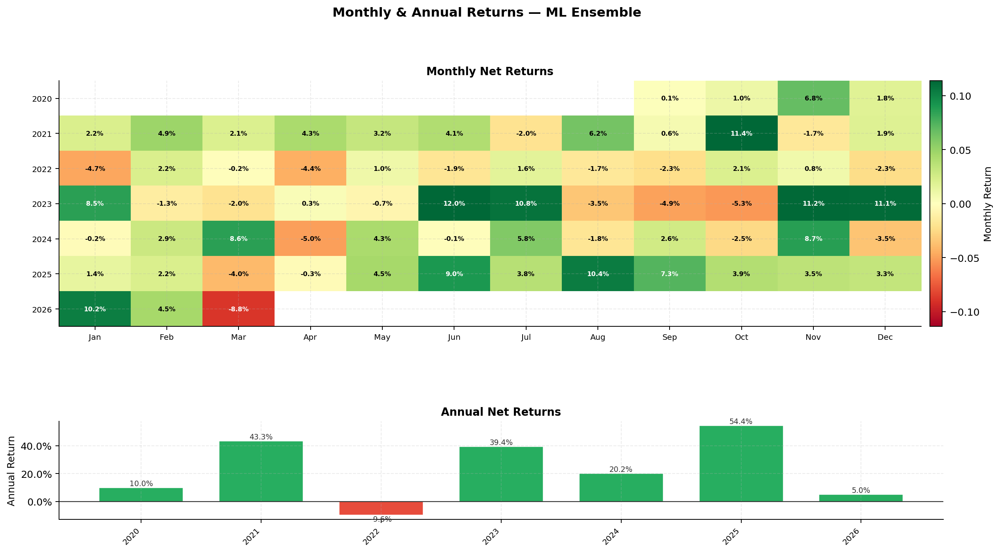
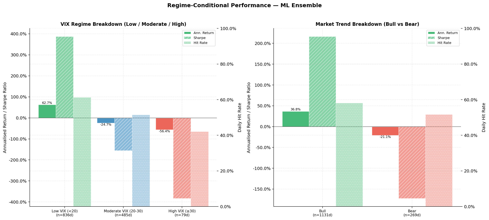
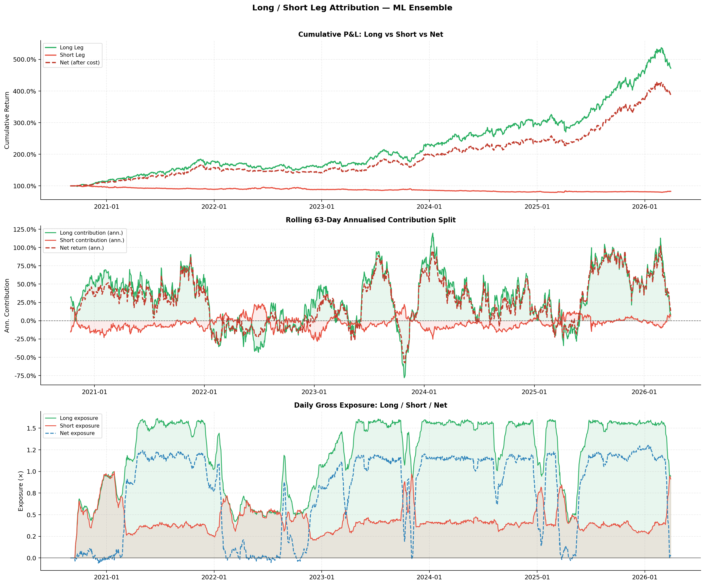

# S&P 500 Multi-Factor ML Alpha System

> **A production-grade quantitative equity pipeline** fusing HLOC factor engineering, dynamic ICIR signal weighting, and a walk-forward ML ensemble into a sector-neutral 130/30 long/short strategy — backtested over a clean 5.5-year OOS period (Sep 2020 – Mar 2026).

**Core philosophy**: Alpha generation is an exercise in *defensive engineering*, not mathematical optimisation. Every design decision — from the multi-window IC weighting to the 10-day embargo gap — exists to ensure results are tradeable, not backtested artefacts.

---

## Key Results at a Glance

| | Linear ICIR | **ML Ensemble** | SPY (Benchmark) |
|---|---|---|---|
| **Total Return** | 66.7% | **287.3%** | 94.1% |
| **CAGR** | 9.63% | **27.60%** | 12.68% |
| **Sharpe Ratio** | 0.861 | **1.697** | 0.745 |
| **Sortino Ratio** | 1.210 | **2.524** | 1.023 |
| **Calmar Ratio** | 0.465 | **1.771** | 0.518 |
| **Max Drawdown** | -20.73% | **-15.59%** | -24.50% |
| **Win Rate** | 53.96% | **56.83%** | 54.12% |
| **Annual Turnover** | 8.35x | 17.52x | — |

> The ML Ensemble achieves a **2.52 Sortino vs 1.70 Sharpe** — a highly asymmetric profile indicating the strategy earns return by cutting downside, not by taking on symmetric risk. Max drawdown (-15.6%) is shallower than the benchmark's (-24.5%) despite producing 2.2x the CAGR.

---

## Performance Dashboard (ML Ensemble)



The top panel shows the ML Ensemble cumulative return reaching **~400%** against SPY's ~200% over the backtest window, with a consistently positive rolling 252-day Sharpe that only dipped negative briefly during the 2022 rate-shock bear market. 

---

## Strategy Comparison: Linear ICIR vs ML Ensemble vs SPY



The full metrics table validates that the ML Ensemble dominates on every risk-adjusted metric. Notably, the ensemble achieves a lower Max Drawdown (-15.6%) than both the linear strategy (-20.7%) and SPY (-24.5%), while delivering more than double the CAGR of SPY. The linear ICIR strategy, while simpler, still beats SPY on Sharpe (0.86 vs 0.74) with substantially lower drawdown risk.

---

## Architecture

```
main.py
├── Stage 1   Data ingestion          data_loader.py
│             Alpaca OHLCV + VIX/SPY/macro (Yahoo) + news sentiment (Alpaca News API)
├── Stage 2   Factor engineering      features.py
│             11-factor HLOC library + cross-sectional cleaning pipeline
├── Stage 3   ML feature matrix       alpha_models.py
│             Panel construction, macro/sentiment join, binary top-decile label
├── Stage 4   ICIR composite signal   features.synthesize_dynamic()
│             Multi-window ICIR blend + IC sign-consistency protection
├── Stage 5   Alphalens tearsheet     simulator.prepare_alphalens_data()
├── Stage 6   Linear ICIR backtest    simulator.run_realistic_backtest()
├── Stage 7   Walk-forward ML         alpha_models.run_ml_scoring()
│             LightGBM + Ridge ensemble, 27 quarterly folds, 10-day embargo
├── Stage 8   ML backtest             simulator.run_realistic_backtest()
└── Stage 9   Report generation       visualization.py
```

---


### Feature Importance (LightGBM, Last Fold)



The LightGBM feature importance confirms HLOC-derived factors dominate: `mkt_vol_21d`, `TurnoverRate`, `ParkinsonVol_63`, `ParkinsonVol_21`, `OvernightGapRev`, and `IntradayMom` occupy the top 6 positions. The consistently positive OOS IC across all 27 folds (bottom panels, mean **+0.216**) with no downward trend demonstrates the model captures structural — not historical — market inefficiencies.

---

## Signal Weighting: Dynamic ICIR Synthesis

Each factor is weighted proportionally to its rolling Information Ratio (IC mean / IC std). Three lookback windows are blended to prevent weight flip-flopping from short-window noise:

| Window | Length | Blend Weight |
|---|---|---|
| Short | 63 days | 0.20 |
| Medium | 126 days | 0.30 |
| Long | 252 days | 0.50 |

**IC sign-consistency protection**: for directionally unstable factors (`LowVol_63`, `ParkinsonVol_*`), if the monthly IC is negative for 3 consecutive months, the weight is zeroed until recovery. The IC series is shifted forward by `forward_days` before weight computation — ensuring zero look-ahead at every rebalance point.



---

## Factor IC Analysis



`IntradayMom` stands out with a mean monthly IC of **+0.111** and ICIR of **+2.848** — roughly 3x the ICIR of any other single factor. The Parkinson volatility factors show strongly negative IC and ICIR (factors predict reversal), consistent with the low-volatility anomaly. This chart directly informs which factors receive the largest ICIR weights in the composite.

---

## ML Scoring Engine: Walk-Forward with Embargo

```
|<--- train (1.5 yr) --->|<- embargo (10d) ->|<- test (~63d) ->|
```

- **Target**: binary label — top 10% cross-sectional 10-day forward return (class imbalance 9:1, compensated via `scale_pos_weight`)
- **Models**: LightGBM + L2-regularised logistic regression, ensembled 0.7/0.3
- **Features**: 11 HLOC factors + 3 market-level contextual + 4 macro (treasury shock, credit spread, tech RS, vol shock) + Alpaca news sentiment + sector code + 2 interaction terms
- **Retraining**: every 63 trading days (~1 quarter), over 27 total folds

**Walk-forward OOS IC summary**: mean **+0.216**, range +0.142 to +0.285, zero negative folds across 6 years. The cumulative mean IC (middle panel above) stabilises rapidly and shows no decay — evidence of structural signal, not overfitting.

---

## Backtest Engine: Variable Beta 130/30

**Strategy**: sector-neutral long/short equity, rebalanced every 10 days.

**Portfolio construction**:
- Select top/bottom 10% of stocks within each sector by factor score
- Weight by inverse 21-day realised volatility (risk parity within each leg)
- Smooth target weights over the holding period via rolling mean to reduce rebalancing churn
- Turnover band: only trade when a position deviates >0.5% from target
- Hard per-stock cap: ±10% of NAV

**Dynamic risk overlays**:
| Control | Mechanism |
|---|---|
| VIX deleveraging | Linearly reduce gross exposure as VIX rises above 25 |
| Bull/bear regime | Long target 1.30x (bull) / 0.80x (bear) based on price vs 120-day SMA |
| Macro winter | Simultaneous bear trend + rate shock (>35bp in 5d) → cap both legs at 0.50x |
| Transaction cost | 5 bps per unit of one-way turnover |

### Drawdown Analysis



The worst drawdown (-14.94%) occurred during the 2022 rate-shock bear market, recovering in 277 days. All other major drawdowns are shallower than -13%, and the average recovery is under 60 days — consistent with a strategy that harvests structural cross-sectional return rather than making directional market bets.

### Monthly & Annual Returns



Annual returns: **+43.3% (2021), +39.4% (2023), +54.4% (2025)** — the only negative year was 2022 (-9.6%) during the historic rate-shock environment. The monthly heatmap shows broadly green across all years with no systematic seasonal weakness.

### Regime-Conditional Performance



The strategy's alpha is strongly regime-conditional — it thrives in low-VIX environments (+62.7% annualised, bull markets) and degrades in high-stress regimes (VIX >=30). This is the expected behaviour for a cross-sectional equity L/S strategy: the regime overlays (VIX deleveraging, macro winter filter) exist specifically to limit losses during the high-VIX tail, which represents only 6% of trading days in the sample.

### Long/Short Attribution



The long leg drives the overwhelming majority of cumulative P&L (~500% cumulative vs ~0% for the short leg). The short leg acts primarily as a hedge and drawdown buffer rather than a standalone alpha source. Rolling 63-day exposure shows active leverage management — the dynamic risk controls visibly compress gross exposure during stress periods (2022, early 2023).

---

## Data Integrity & Look-Ahead Bias Controls

Defensive engineering is a first-class concern. Five automated tests run on every build:

| Test | What it catches |
|---|---|
| **Ghost Stock Test** | Pre-IPO prices must be NaN — rules out backward-fill contamination |
| **NaN & Continuity** | Pre-IPO volume must be 0; post-IPO prices must be continuous |
| **Time Machine Test** | Factor computed on truncated history must be bit-identical to full history at same date |
| **Alignment Test** | ML panel binary labels verified against manually computed forward-return ranks |
| **Volume Halt Test** | Volume on price-flat (trading halt) days must not be forward-filled |
| **News Timezone Test** | After-hours news (>=16:00 ET) correctly attributed to next trading day, including Friday -> Monday |

```bash
python -m src.test_data_integrity
```

Additional pipeline-level controls:
- IC series shifted `forward_days` before ICIR weight computation
- 10-day embargo between train end and test start in walk-forward ML
- VIX and macro features lagged by 1 day before use in weight construction
- Alpaca data fetched with `adjustment=ALL` (split- and dividend-adjusted)

---

## Quick Start

```bash
pip install -r requirements.txt

# Full run (linear ICIR + ML ensemble)
python main.py

# Linear ICIR only (faster, no ML dependency)
python main.py --linear-only

# Force re-download all market data
python main.py --force-refresh

# Skip Alphalens tearsheet generation
python main.py --no-alphalens

# Run data integrity tests
python -m src.test_data_integrity
```

Data is cached in `data/raw/` after the first run. Subsequent runs load from disk unless `--force-refresh` is passed.

**Note**: Alpaca API credentials are hardcoded in `src/data_loader.py`. Replace with your own key before running.

---

## Reports Reference

| File | Contents |
|---|---|
| `performance_dashboard.png` | Equity curve vs SPY, rolling 252-day Sharpe, drawdown, factor IC heatmap |
| `strategy_comparison.png` | Linear vs ML vs SPY equity curves + full metrics table |
| `ml_diagnostics.png` | Per-fold OOS IC (LightGBM / Ridge / Ensemble), cumulative IC, feature importance |
| `factor_ic_summary.png` | Mean monthly IC and ICIR bar charts for every factor |
| `icir_weight_history.png` | Rolling ICIR time-series + normalised weight allocation over time |
| `monthly_returns_heatmap.png` | Calendar heatmap of monthly net returns + annual bar chart |
| `drawdown_analysis.png` | Underwater equity chart with top-5 drawdowns + recovery table |
| `regime_conditional_returns.png` | Return / Sharpe / hit-rate split by VIX regime and bull/bear trend |
| `long_short_attribution.png` | Long-leg vs short-leg cumulative P&L, rolling contribution, daily exposure |
| `cost_turnover_analysis.png` | Gross vs net return decomposition, daily turnover and cost time-series |
| `reports/plots/` | Alphalens tearsheet: quantile returns, IC time-series, rank autocorrelation |

---

## Requirements

- Python 3.10+
- Alpaca Markets API key (paper or live)
- Key dependencies: `alpaca-trade-api`, `yfinance`, `lightgbm`, `scikit-learn`, `alphalens-reloaded`, `pandas`, `numpy`, `scipy`, `matplotlib`

See `requirements.txt` for the full pinned dependency list.
